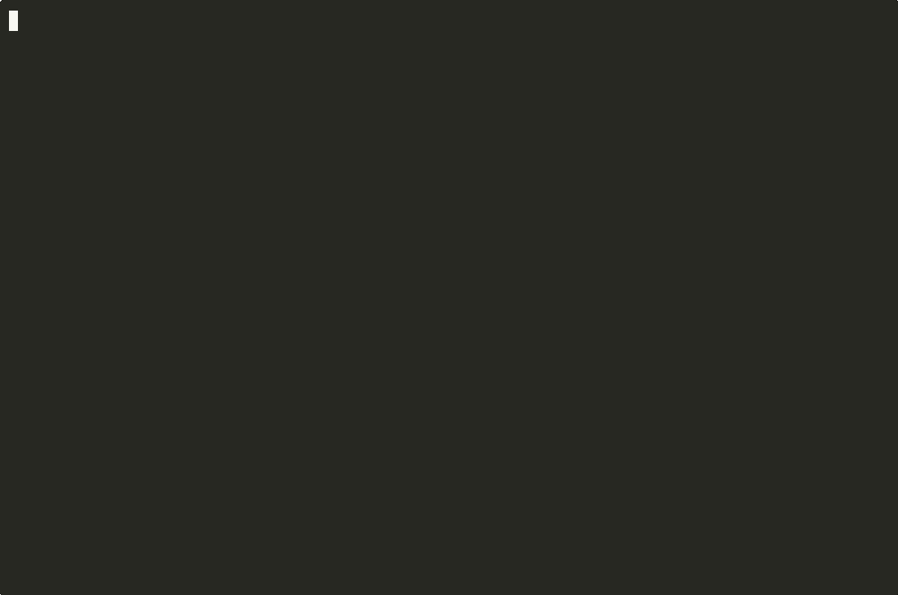

<div align="center">

# Kondukt

**Postman for MCP servers — test, validate, debug, and scaffold.**

[](https://www.npmjs.com/package/kondukt)
[](https://www.npmjs.com/package/kondukt)
[](./LICENSE)
[](https://modelcontextprotocol.io)

</div>

---

Kondukt is an open-source developer toolkit for the [Model Context Protocol (MCP)](https://modelcontextprotocol.io). It connects to any MCP server, inspects what it exposes, validates protocol compliance, calls tools interactively, and scaffolds new servers from templates.

**And it's itself an MCP server** — so you can register it with Claude Code, Codex, or Gemini CLI, and ask your AI agent to test and validate other MCP servers for you.



> **Status:** v0.1.x. Stable enough for daily use, but still evolving. Bug reports and PRs welcome.

## Two ways to use it

**As a CLI — fast feedback while you build:**

```bash
npx kondukt test "npx -y @modelcontextprotocol/server-everything"
npx kondukt validate "npx -y @modelcontextprotocol/server-everything"
```

**As an MCP server — your agent does the work:**

```bash
claude mcp add kondukt -- npx kondukt serve
```

Then, inside Claude Code:

> "Test the MCP server at `npx my-server` and tell me what tools it exposes. Then run a validation and fix anything that fails."

Claude calls Kondukt's tools directly. No context-switching between terminal and editor.

## Quick start

No install needed — everything runs via `npx`.

```bash
# Discover tools, resources, and prompts on any MCP server
npx kondukt test "npx -y @modelcontextprotocol/server-everything"

# Run 19 protocol compliance checks and get a 0–100 score
npx kondukt validate "npx -y @modelcontextprotocol/server-everything"

# Call a specific tool with arguments
npx kondukt call "npx -y @modelcontextprotocol/server-everything" \
  --tool echo --args '{"message": "hello"}'

# Generate a new MCP server project
npx kondukt scaffold my-server --template typescript \
  --tool "get_weather:Get weather for city:city:string"

# Generate AI context files (CLAUDE.md, AGENTS.md, GEMINI.md) for this repo
npx kondukt agent-docs . --all
```

## Features

### `kondukt test` — inspect any MCP server

Connects to a server (stdio or HTTP/SSE), auto-discovers tools, resources, and prompts, and prints them in a structured, readable format.

### `kondukt validate` — 19 protocol rules, 0–100 score

Four categories:

- **Tools** — schema validity, descriptions, naming conventions
- **Resources** — URI formats, MIME types, metadata
- **Prompts** — argument schemas, descriptions
- **Protocol** — initialization, capabilities, error handling

Every violation comes with a rule ID, severity, and a suggested fix.

### `kondukt call` — interactive debugging

Execute any tool exposed by a server with custom arguments. See the raw response. Essential for reproducing bugs.

### `kondukt scaffold` — new server in 10 seconds

Generates a complete, runnable MCP server project. TypeScript or Python templates. Includes types, tests, CI config, and README. Define tools from the CLI:

```bash
npx kondukt scaffold weather-server \
  --template typescript \
  --tool "get_forecast:Get forecast:city:string,days:number"
```

### `kondukt agent-docs` — context files for AI coding tools

Analyzes a codebase and generates `CLAUDE.md`, `AGENTS.md`, or `GEMINI.md`. Detects frameworks, ORMs, test runners, and project conventions via static analysis.

### `kondukt serve` — run Kondukt as an MCP server

Exposes all of the above as MCP tools. Register once, use from any MCP-compatible agent.

## Install

Most commands work with zero install via `npx`. For frequent use:

```bash
npm install -g kondukt
```

Or use it as a library:

```bash
npm install kondukt
```

```ts
import { McpConnection, SchemaValidator } from "kondukt";

const conn = new McpConnection({
  type: "stdio",
  command: "npx",
  args: ["-y", "@modelcontextprotocol/server-everything"],
});

await conn.connect();
const result = await new SchemaValidator().validate(conn);
await conn.disconnect();

console.log(result.score); // 0–100
console.log(result.issues);
```

## Transports

Kondukt supports both transports defined by the MCP spec:

- **stdio** — pass the command directly: `npx kondukt test "npx -y my-server"`
- **HTTP / SSE** — pass a URL: `npx kondukt test "https://my-server.example.com/mcp"`

## Why Kondukt

MCP has 97M+ SDK downloads and 10,000+ published servers. Every major AI vendor ships it. And yet, building an MCP server today feels like writing HTTP APIs in 2005 — no Postman, no linter, no scaffolder. The only existing tool (MCP Inspector) is a basic debugger; there's no validation, no scoring, no project generation.

Kondukt is the tool I wanted and couldn't find. If you build MCP servers, it should save you hours.

## Comparison

|                                 | MCP Inspector | Kondukt                   |
| ------------------------------- | ------------- | ------------------------- |
| Inspect tools/resources/prompts | ✅            | ✅                        |
| Call tools interactively        | ✅            | ✅                        |
| Protocol validation             | ❌            | ✅ (19 rules)             |
| Quality score                   | ❌            | ✅ (0–100)                |
| Scaffold new servers            | ❌            | ✅                        |
| Usable from AI agents           | ❌            | ✅ (itself an MCP server) |
| AI context file generation      | ❌            | ✅                        |

## Development

### Regenerating the demo assets

Run `./scripts/record-demo.sh`. Requires Homebrew.

The script builds the CLI, records a fresh `.cast` with `asciinema`, renders it
to `.gif` via `agg`, and produces a web-friendly `.mp4` with `ffmpeg`. All three
outputs land in `assets/` and are committed so the README renders on GitHub
without a build step.

## Contributing

Issues, PRs, and feedback all welcome.

If you find a bug, the fastest path is an issue with a reproducing command. If Kondukt's validator gets something wrong, that's also a bug — file it.

## License

[MIT](./LICENSE)

## Author

Built by **Alex Burov** — [GitHub](https://github.com/kondukt-dev) · [X/Twitter](https://x.com/alexburovmain)
